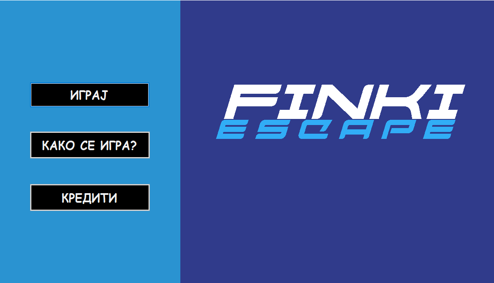

# FinkiEscape

## Опис на играта

Апликацијата е еден вид на puzzle игра која што е составена од помали мини игри. Целта на играта е играчот е заробен во
една просторија и тој треба да побегне од заклучената просторија со решавање на тие помали мини игри. Само на тој начин може да се заврши главната игра.

На почеток кога ќе ја стартуваме апликацијата можеме да видиме лого на играта и 
мени составено од 3 дугмиња: "ИГРАЈ", "КАКО СЕ ИГРА" и "КРЕДИТИ". <br>
Доколку се притисни на дугмето "ИГРАЈ", играта започнува. <br>
Доколку се притисни на дугмето "КАКО СЕ ИГРА", се покажува информација од целта на играта. <br>
Доколку се притисни на дугмето "КРЕДИТИ", се покажува информација од који ја направиле играта. <br>



Кога ќе се започне со играта, на почеток има прикажано слика од просторијата, односно првата сцена и краток дијалог
кој го воведува играчот во играта и му укажува на што точно треба да прави. Играчот ги следи тие инструкции и постапува по нив.
После завршување на дијалогот играчот има можност да притисне со маусот на неколку означени локации кои ќе го префрлат на друга сцена.<br>
<br>
Како да знае играчот каде се тие локации ? 
- Секоја локација, кога ќе се направи MouseHover врз неа се мењава Cursor на 
глувчето, па така играчот ќе знае доколку притисне на таа локација, ќе се промени сцената за тој евент.


Првата мини игра е игра на спојување на жици, има три жици во три различни бои. Оваа игра се решава на тој начин што
сите жици треба да бидат поврзани со нивната соодветна боја. Доколку се реши оваа мини игра, играчот поминува на почетната сцена
а потоа на следна сцена каде се наоѓаат повеќе мини игри кои што треба да се решат.


Првата мини игра од другата сцена е отклучена а сите други мини игри се заклучени.Доколку се реши првата мини игра се 
отклучува втората мини игра и така е и за сите други мини игри. Првата мини игра е математика за деца. Со точно решавање 
на сите зададени задачи, формата се затвара и тоа ни означува дека првата мини игра е помината.


Втората мини игра се отклучува со поминување на првата мини игра. Втората мини игра е X/O против компјутер.
Играта е со Minimax алгоритам. Доколку играчот изгуби од компјутерот или пак доколку дојде до нерешено, играта започнува
повторно, односно се ресетира. Со победување на компјутерот во оваа мини игра, формата се затвара и тоа ни означува дека втората мини игра е помината.


После секоја помината игра се прикажува следнава порака:


Третата мини игра се отклучува со поминување на втората мини игра. Третата мини игра е игра со топки.
Со стартување на играта, 10 топки се ресфрлуваат на 10 рандом локации во формата и играчот треба успешно да селектира пет или повеќе топки за играта успешно да се заврши, но доколку не се селектирани пет или повеќе топки, играчот игра повторно.


Четвртата мини игра се отклучува со поминување на третата мини игра. Четвртата мини игра е IQ квиз. IQ квизот е составен 
од десет прашања. За секое прашање понудени се четири одговори. Доколку се одбери точен одговор, тој светнува зелен а во
спротивно доколку се одбери погрешен одговор тогаш тој светнува црвен. Оваа мини игра се поминува така што 5 или повеќе прашања се точно одговорени.


Петтата мини игра се отклучува со поминување на четвртата мини игра. Петтата мини игра е игра на меморија. Има 16 квадратчиња и во секое квадратче по една слика. Играта се игра така што се притиска на едно од 16 квадратчиња се открива првата слика и после се притиска на друго квадратче и се открива втората слика. Доколку тие слики не се совпаѓаат, тие остануваат прикажани за 1 секунда и потоа се враќаат во скриена состојба. Доколку тие слики се совпаѓаат тогаш тие остануваат прикажани се додека не се заврши играта. Играта завршува со откривање на сите исти сликички.


Шестата мини игра се отклучува со поминување на петтата мини игра. Шестата мини игра е сложувалка чии што парчиња се лизгаат. Сложувалката е составена од 16 квадратчиња, во секое квадратче има еден број од 1 до 15, освен во едно квадратче каде што нема ништо. Играта се решава на тој начин што броевите ќе бидат подредени во растечки редослед.


По завршувањето на шестата мини игра, играчот добива шест-цифрен код кој што код го внесува во завршната сцена и со тоа играчот ја решава и главната игра.


Слика од внесување на кодот:


На крајот е прикажана кратка честитка и времето потребно за завршување на целата игра.


## Објаснубање на класата [ConnectWires](FinkiEscapa/ConnectWires.cs)
се чуваат во `Rectangle` променливи за позициите на почетната и крајната областа на жиците каде што може да се кликне со гчувчето
```c#
//Strat
static Rectangle r1Area = new Rectangle(118, 93, 15, 15);
static Rectangle b1Area = new Rectangle(118, 168, 15, 15);
tatic Rectangle y1Area = new Rectangle(118, 243, 15, 15);
//End
static Rectangle b2Area = new Rectangle(466, 93, 15, 15);
static Rectangle y2Area = new Rectangle(466, 168, 15, 15);
static Rectangle r2Area = new Rectangle(466, 243, 15, 15);

List<Rectangle> rectangles = new List<Rectangle>{ r1Area, b1Area, y1Area, r2Area, b2Area, y2Area};
```
исто така се чива и бојата со која треба да се обојат жиците
```c#
Color[] colors = { Color.FromArgb(224, 27, 34), Color.FromArgb(0, 114, 188), Color.FromArgb(225, 199, 26) };
```

### MouseDown
Со клил на формата се проверува дали е запичнато поврзувањето на жиците (`connectingWiresStarted == true`). Ако не е, се проверува дали позицијата на глувчето е во почетната областа каде што треба да почне поврзувањето на жицата (`isStartPos(rect)`). Аке тој услов е задоволен се проверува на која облас е кликнато и според тоа се одлучува која боја да биде жицата и се одредува таргет позицијата каде што треба да заврши жицата и се означива дека е започнато поврзувањето на жиците. Ако е запичнато поврзувањето на жиците, се проверува дали локацијата на глувчето е во крајноте области (`isEndPos(rect)`). Ако е, се проверува дали е точната крајна позиција кликната. ако и тој услов е исполнет се означива дека таа жица е поврзана и се означува дека повеч не се поврзува жица.
```c#
private void ConnectWires_MouseDown(object sender, MouseEventArgs e)
        {
            Rectangle rect = isOnTarget(e.Location);

            if (!connectingWiresStarted && isStartPos(rect))
            {
                currentIndex = rectangles.IndexOf(rect);

                if (drawnLine[currentIndex])
                    return;

                connectingWiresStarted = true;

                points[0] = rect.Location;
                points[0].Offset(7, 7);

                return;
            }

            if (isEndPos(rect) && rect == rectangles[currentIndex + 3])
            {
                drawnLine[currentIndex] = true;
                connectingWiresStarted = false;
                isFinished();
            }

        }
```
ако сите жици се поврзани се враќа `DialogResult.OK`
```c#
private void isFinished()
        {
            if(drawnLine[0] && drawnLine[1] && drawnLine[2])
            {
                DialogResult = DialogResult.OK;
            }
        }
```


### MouseMove 
во MouseMove методата се проверува дали локацијата на глувчето е во некоја областа. Ако е, се менува курсорот на глувчето во `Cursors.Hand`
```c#
private void ConnectWires_MouseMove(object sender, MouseEventArgs e)
        {

            if (isOnTarget(e.Location) != Rectangle.Empty)
            {
                Cursor.Current = Cursors.Hand;
                
            }else Cursor.Current = Cursors.Default;
            
            points[1] = e.Location;

        }
```
### Paint

во Paint методата се проверува дали некоја жица е поврзана. Ако е, се црта таа жица на формата
```c#
private void ConnectWires_Paint(object sender, PaintEventArgs e)
        {

            if (drawnLine[0])
            {
                e.Graphics.DrawLine(new Pen(colors[0], 15), lines[0][0], lines[0][1]);
            }
            if (drawnLine[1])
            {
                e.Graphics.DrawLine(new Pen(colors[1], 15), lines[1][0], lines[1][1]);
            }
            if (drawnLine[2])
            {
                e.Graphics.DrawLine(new Pen(colors[2], 15), lines[2][0], lines[2][1]);
            }

            if (connectingWiresStarted)
                e.Graphics.DrawLine(new Pen(colors[currentIndex],15), points[0], points[1]);

            Invalidate();

        }
```
Ако поврзувањето на жици е започнато, се црта и таа жиза
